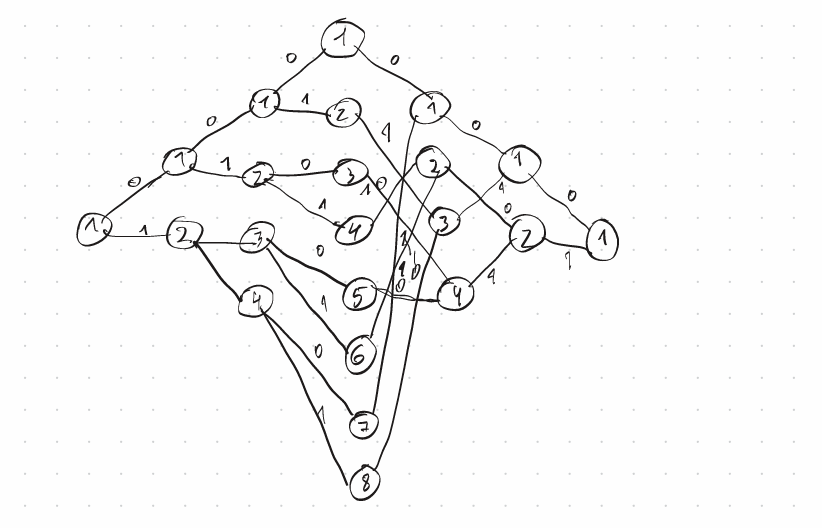
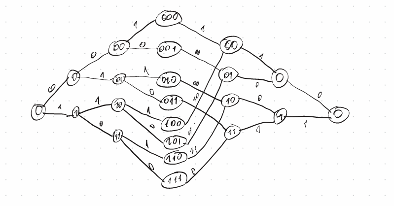

# Задача. Построение решеток линейного кода

Рассматривается линейный код с порождающей матрицей:

$$
G =
\begin{pmatrix}
1 & 0 & 1 & 1 & 0 & 1\\
0 & 0 & 1 & 1 & 1 & 0\\
0 & 1 & 0 & 1 & 1 & 1
\end{pmatrix}
$$

Требуется построить три представления решетки:
- напрямую по множеству кодовых слов,
- используя порождающую матрицу,
- используя проверочную матрицу.

---

# 1. Построение через множество кодовых слов

## 1.1 Генерация кодовых слов

Так как код имеет размерность $k=3$, перебираем все информационные векторы:

| Информационный вектор | Кодовое слово |
|----------------------|--------------|
| 000 | 000000 |
| 100 | 101101 |
| 010 | 001110 |
| 001 | 010111 |
| 110 | 100011 |
| 101 | 111010 |
| 011 | 011001 |
| 111 | 110100 |

---

## 1.2 Идея построения решетки

Решетка строится по префиксам кодовых слов:
- на каждом шаге фиксируется уже выбранная часть слова,
- вершины соответствуют возможным продолжениям.

Обозначим через $c^p$ первые $p$ символов кодового слова.

---

## 1.3 Структура переходов

| Шаг | Префикс | Возможные продолжения |
|-----|--------|----------------------|
| 0 | $\varnothing$ | все кодовые слова |
| 1 | 0 | 000000, 001110, 010111, 011001 |
| 1 | 1 | 101101, 100011, 111010, 110100 |
| 2 | 00 | 000000, 001110 |
| 2 | 01 | 010111, 011001 |
| 2 | 10 | 101101, 100011 |
| 2 | 11 | 111010, 110100 |

Далее процесс продолжается до полного восстановления слова длины 6.

Таким образом формируется решетка, в которой:
- вершины — это префиксы,
- рёбра — добавление очередного бита.

---

# 2. Построение через порождающую матрицу

## 2.1 Приведение матрицы

Для удобства анализа преобразуем матрицу элементарными операциями:

$$
G \sim
\begin{pmatrix}
1 & 1 & 0 & 1 & 0 & 0\\
0 & 1 & 0 & 1 & 1 & 1\\
0 & 0 & 1 & 1 & 1 & 0
\end{pmatrix}
$$

---

## 2.2 Интерпретация

Каждая строка отвечает одному информационному символу.

На позиции $i$ учитываются только те строки, где есть ненулевой элемент — они называются **активными**.

---

## 2.3 Принцип построения

- вершины на уровне $i$ соответствуют значениям активных информационных символов,
- переходы определяются вкладом столбца $i$ матрицы $G$,
- кодовый символ вычисляется как сумма активных компонент.

Таким образом:
- структура решетки определяется распределением ненулевых элементов в столбцах,
- сами значения кодовых символов — линейными комбинациями строк.

---

## 2.4 Кодовые слова (для согласованности)

| ИС | КС |
|----|----|
| 000 | 000000 |
| 100 | 110100 |
| 010 | 010111 |
| 001 | 001110 |
| 110 | 100011 |
| 101 | 111010 |
| 011 | 011001 |
| 111 | 101101 |

(порядок отличается из-за преобразования матрицы)

---

# 3. Построение через проверочную матрицу

## 3.1 Проверочная матрица

$$
H =
\begin{pmatrix}
0 & 1 & 1 & 1 & 0 & 0\\
1 & 1 & 1 & 0 & 1 & 0\\
1 & 1 & 0 & 0 & 0 & 1
\end{pmatrix}
$$

---

## 3.2 Подход

Решетка строится через синдромы:

$$
s = H \cdot v^T
$$

На каждом шаге:
- вычисляется частичный синдром,
- вершины соответствуют возможным значениям синдрома.

---

## 3.3 Развитие синдромов по шагам

| Шаг | Возможные синдромы |
|-----|------------------|
| 0 | 000 |
| 1 | 000, 011 |
| 2 | 000, 011, 111, 100 |
| 3 | 000, 101, 110, 111, 011, 010, 001, 100 |
| 4 | 000, 001, 010, 011, 011, 010, 001, 000 |
| 5 | 000, 001, 000, 001, 001, 000, 001, 000 |
| 6 | 000 |

---

## 3.4 Интерпретация

- каждая вершина — это текущее значение синдрома,
- переход соответствует добавлению нового символа,
- одинаковые синдромы можно объединять (схлопывание решетки).

---

# 4. Итог

Все три способа приводят к одной и той же структуре решетки:
- различается только способ нумерации вершин,
- графы изоморфны.

Это подтверждает корректность построения.
