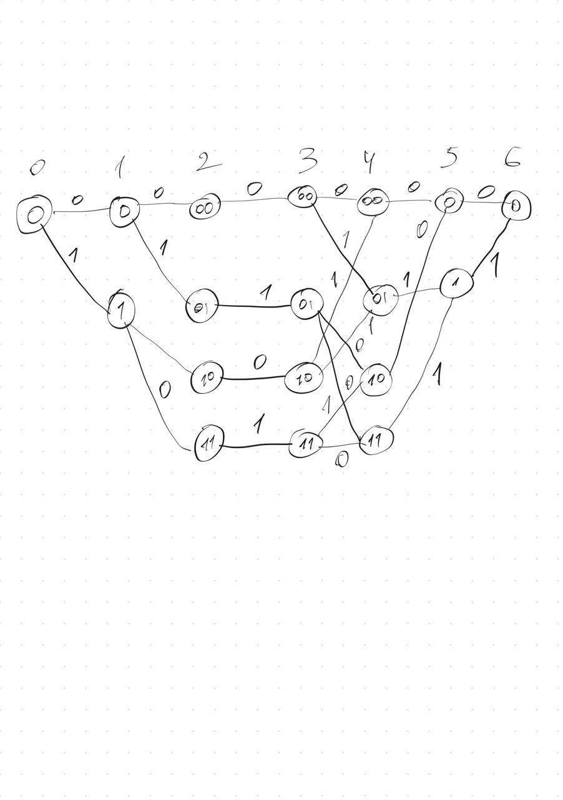
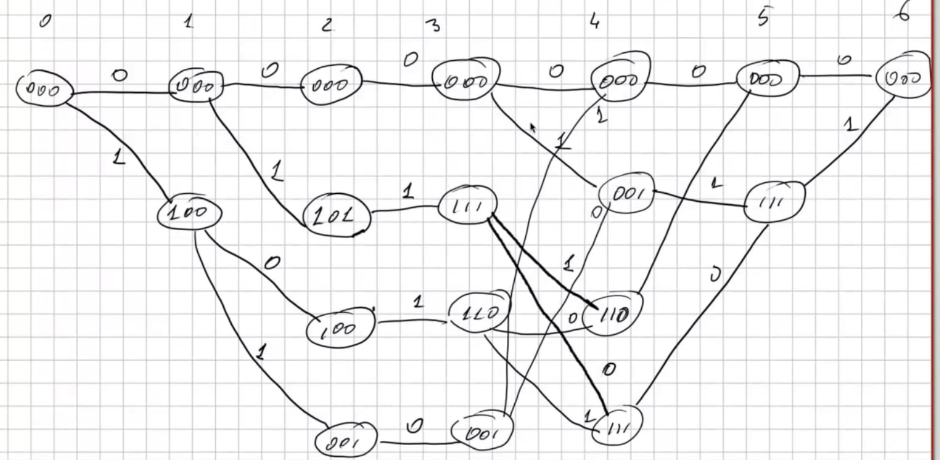

## Задача 1

Требуется построить решётку кода по заданной порождающей матрице и проверить её совпадение (с точностью до переобозначения узлов) с синдромной решёткой.

### Исходная матрица

$$
G =
\begin{pmatrix}
1 & 0 & 1 & 1 & 0 & 1 \\
1 & 0 & 1 & 0 & 1 & 0 \\
1 & 1 & 0 & 1 & 0 & 0
\end{pmatrix}
$$

---

### Приведение к минимальной спэновой форме

Выполним элементарные преобразования строк над $\mathbb{F}_2$:

$$
G \sim
\begin{pmatrix}
1 & 0 & 1 & 1 & 0 & 1 \\
0 & 0 & 0 & 1 & 1 & 1 \\
1 & 1 & 0 & 1 & 0 & 0
\end{pmatrix}
\sim
\begin{pmatrix}
1 & 0 & 1 & 1 & 0 & 1 \\
0 & 0 & 0 & 1 & 1 & 1 \\
0 & 1 & 1 & 0 & 0 & 1
\end{pmatrix}
$$

$$
G \sim
\begin{pmatrix}
1 & 1 & 0 & 1 & 0 & 0 \\
0 & 1 & 1 & 0 & 0 & 1 \\
0 & 0 & 0 & 1 & 1 & 1
\end{pmatrix}
\sim
\begin{pmatrix}
1 & 1 & 0 & 1 & 0 & 0 \\
0 & 1 & 1 & 1 & 1 & 0 \\
0 & 0 & 0 & 1 & 1 & 1
\end{pmatrix}
$$

Полученная матрица находится в минимальной спэновой форме.

---

### Принцип построения решётки

- На каждом ярусе $i$ рассматриваются активные строки  
- Состояния задаются значениями информационных битов  
- Переходы определяются линейными комбинациями строк матрицы  

---

### Кодовые слова

| $m$ | $mG$ |
|-----|------|
| 000 | 000000 |
| 001 | 000111 |
| 010 | 011110 |
| 011 | 011001 |
| 100 | 110100 |
| 101 | 110011 |
| 110 | 101010 |
| 111 | 101101 |

---

### Построение решётки

Решётка строится по минимальной спэновой форме:

- число состояний на каждом уровне определяется числом активных строк  
- рёбра подписываются кодовыми символами  
- переходы соответствуют линейным комбинациям строк  

---

### Сравнение с синдромной решёткой

---

### Вывод

Решётки совпадают по структуре с точностью до переобозначения узлов.
